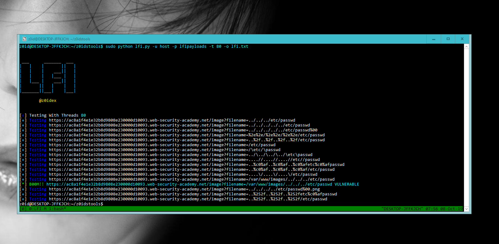
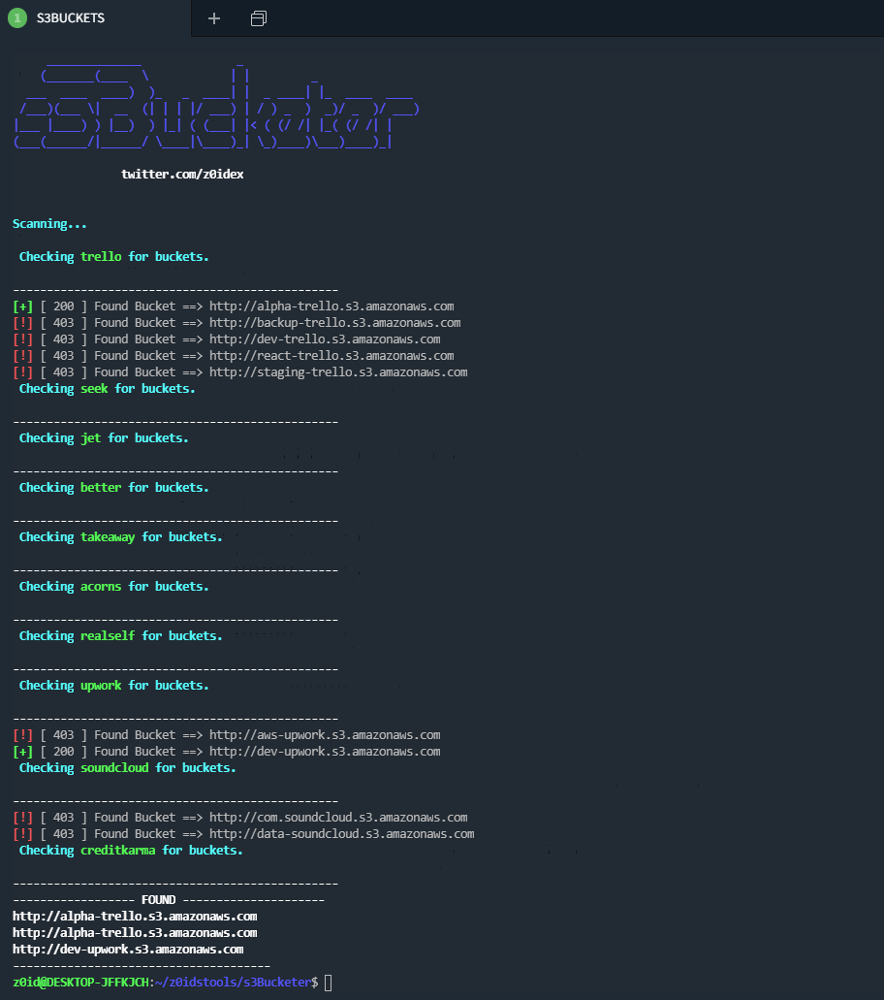

# Bug-Bounty-Tools
These are all the tools I have programmed to help me with bugbountys

## Examples of usage:

### Open Redirects

```
python redir.py -w urls.txt -p payloads -d evil.com -s 0 -o openredirects.txt
```


### Local File inclusion

```
python lfi.py -u urls.txt -p payloads -t 100 -o lfi.txt
```



### SSRF Links

```
python find_urls2.py -d domain.com -t 100 -s urls.txt -o links.txt
```

```
python find_urls2.py -d domain.com -t 100 -s source.js -o links.txt
```

### CRLF 

```
python crlf-auto.py -f urls.txt
```

### S3 Buckets

```
python s3bucketer.py -d urls.txt -b buckets.txt -q 1 -o found.txt
```



Note, automation tools should be the last resort because devlopers would use such tools during there testing.

Enjoy hunters,

If you find something and you enjoy my tools

Donate to me here.

[DONATE](https://paypal.me/krypt0mux)


<a href="http://www.youtube.com/watch?feature=player_embedded&v=BBKlQvxo3xg
" target="_blank"></a>
